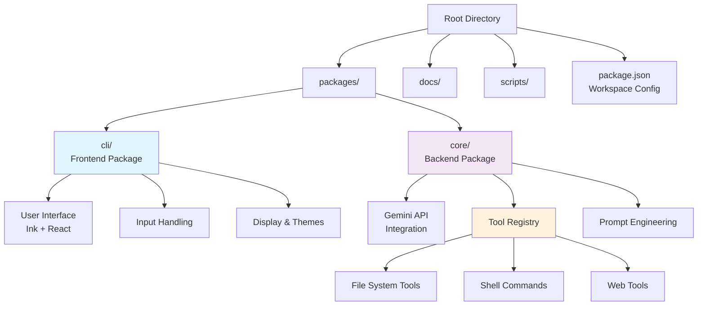
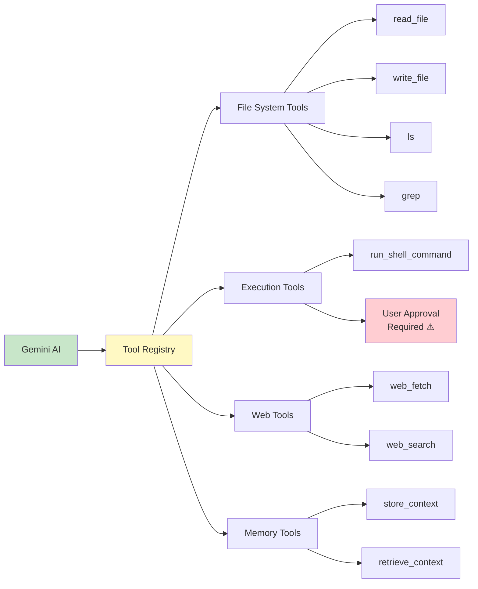
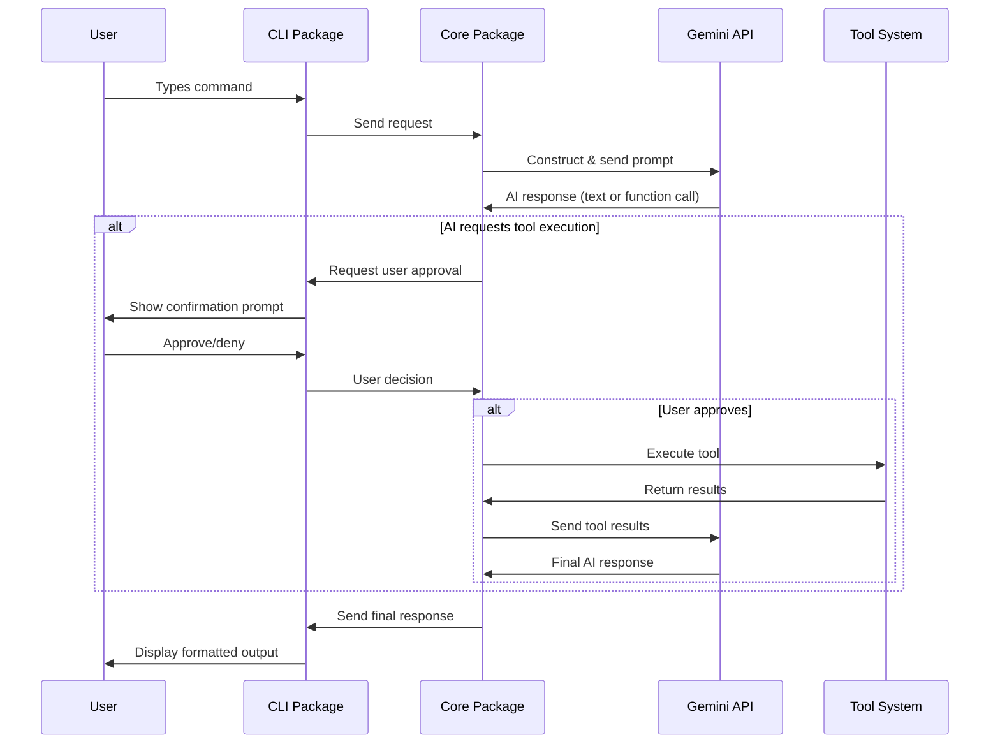

# Unpacking the Gemini CLI: A High-Level Architectural Overview

Imagine typing `gemini "refactor this function to use async/await"` and watching as an AI assistant reads your code, understands the context, and automatically applies the changes. This isn't science fiction—it's the Gemini CLI, a command-line tool that brings Google's Gemini AI directly into your development workflow.

Unlike traditional CLI tools that execute predefined commands, the Gemini CLI acts as an intelligent assistant that can query and edit codebases, generate new applications, and automate complex development tasks through natural language interactions. But how does it work under the hood?

This article is the first in a series exploring the internal workings of the Gemini CLI. We'll start with the foundation: understanding its architecture, core components, and design principles. In upcoming articles, we'll dive deeper into the build process, tool system implementation, and advanced features.

## Why Architecture Matters

Before diving into the technical details, it's worth understanding why the Gemini CLI's architecture is noteworthy. Building an AI-powered CLI presents unique challenges: How do you maintain responsiveness while processing complex AI requests? How do you safely execute system operations based on AI decisions? How do you create an extensible system that can grow with new capabilities?

The Gemini CLI's architecture provides elegant answers to these questions through careful separation of concerns and intelligent design patterns.

## Foundation: The Monorepo Structure

The Gemini CLI uses a monorepo structure, managing multiple related packages within a single repository. This architectural choice is particularly important for AI-powered tools that need tight coordination between multiple components.

```json
{
  "name": "@google/gemini-cli",
  "version": "0.1.9",
  "type": "module",
  "workspaces": [
    "packages/*"
  ],
  "private": "true"
}
```

### Why Monorepo Matters for AI-Powered CLIs

Building an AI assistant that can safely execute system operations presents unique challenges that make the monorepo approach especially valuable:

**Coordinated Development**
When the AI logic in the `core` package needs a new capability, the `cli` package often needs corresponding UI changes. For example, when adding file preview functionality, both packages need updates simultaneously. In a monorepo, developers can make these cross-package changes in a single commit, ensuring they stay in sync.

**Shared Type Safety**
The CLI and core packages share TypeScript interfaces for commands, responses, and tool definitions. In separate repositories, keeping these interfaces synchronized would be error-prone. The monorepo ensures that interface changes immediately highlight any incompatibilities across packages.

**Consistent Tool Integration**
As new tools are added to extend the AI's capabilities, both the core package (which executes them) and the CLI package (which displays confirmations and results) need updates. The monorepo structure ensures these changes happen atomically, preventing broken states where tools exist but can't be properly displayed.

**Simplified Testing Strategy**
Integration tests can span both packages, ensuring that the complete user journey works correctly. Without a monorepo, testing the full interaction between CLI input and AI response would require complex setup across multiple repositories.

### Concrete Benefits in Practice

- **Unified dependency management** - All packages use the same version of critical dependencies like TypeScript and testing frameworks
- **Atomic changes** - Features like "add web search capability" can update tool definitions, AI prompt logic, and UI display in one commit
- **Simplified development workflow** - Developers can run tests, linting, and builds across all packages with single commands
- **Consistent versioning** - The entire CLI ships as a coordinated release, avoiding version compatibility issues
- **Shared tooling** - ESLint rules, Prettier formatting, and build scripts work consistently across all components

The main functionality is organized into focused packages within the `packages/` directory, each handling specific aspects of the CLI's operation.



## The Two-Package Core: Frontend and Backend

At the heart of the Gemini CLI lies a clean separation between user interface and AI orchestration, implemented as two primary packages:

| Package | Role | Key Responsibilities |
|---------|------|---------------------|
| `packages/cli` | **Frontend** | User input, terminal display, conversation history, themes, CLI configuration |
| `packages/core` | **Backend** | Gemini API interaction, prompt construction, conversation management, tool execution |

### packages/cli: The Interactive Terminal Interface

The `cli` package creates the user experience you see in your terminal. Built on [Ink](https://github.com/vadimdemedes/ink)—a React renderer for command-line apps—it transforms the static terminal into a dynamic, interactive environment.

For example, when you run `gemini "explain this error"`, the CLI package handles:
- Capturing your input
- Displaying the AI's response with proper formatting
- Managing conversation history so you can reference previous exchanges
- Applying your preferred color themes and display settings

### packages/core: The AI Orchestration Engine

While the CLI package focuses on user interaction, the `core` package operates behind the scenes as the intelligent coordinator. When you ask the Gemini CLI to "fix all ESLint errors in this project," the core package:

1. **Constructs intelligent prompts** for the Gemini API, including relevant context like project structure and error details
2. **Manages the conversation flow** with the AI model
3. **Orchestrates tool execution** when the AI needs to read files, run commands, or perform other actions
4. **Handles error recovery** and ensures robust operation

This separation means the same intelligent backend could potentially power other interfaces—perhaps a web UI or IDE extension—while the CLI package could be enhanced with new display features without affecting the AI logic.

## The Power of Tools: Extending AI Capabilities

The most interesting aspect of the Gemini CLI is its "tool" system. These aren't just utilities—they're specialized modules located in `packages/core/src/tools/` that give the Gemini AI direct access to your local environment.

Here's how it works in practice:

**User:** `gemini "find all TODO comments in my React components"`

**Behind the scenes:**
1. The AI receives this request and decides it needs to search files
2. It calls the `grep` tool to search for "TODO" in `.jsx` and `.tsx` files  
3. The tool returns the results to the AI
4. The AI formats the findings and presents them to you

**Key tool categories include:**



- **File System Tools:** `read_file`, `write_file`, `ls`, `grep` for direct file manipulation
- **Execution Tools:** `run_shell_command` for automating build processes and running tests
- **Web Tools:** `web_fetch` and `web_search` for gathering external information
- **Memory Tools:** For maintaining context across sessions

### Safety First: User Confirmation

A critical design principle is user control over system modifications. Any tool that can modify files or execute shell commands requires explicit user approval:

```
🤖 I need to run this command to fix the linting errors:
   npx eslint --fix src/

❓ Do you approve this action? (y/n)
```

This ensures you maintain complete control over potentially destructive operations.

## The Interaction Flow: From Input to Output

Understanding how these components work together reveals the elegance of the system:



**Step-by-step breakdown:**

1. **User types a request** in the terminal
2. **CLI package captures input** and sends it to the core package
3. **Core package constructs an optimized prompt** including conversation history and available tools
4. **Gemini API processes the request** and may respond with text or a tool execution request
5. **If tools are needed**, core package executes them (with user approval for system changes)
6. **AI receives tool results** and formulates a final response
7. **CLI package displays the response** with appropriate formatting

## Design Principles in Action

The architecture reflects three core principles:

**Modularity:** The clean separation between CLI and core packages enables independent development and testing. You could build a different interface while reusing all the AI logic, or enhance the AI capabilities without touching the user interface.

**Extensibility:** Adding new capabilities is straightforward—create a new tool module and register it with the system. This design has already enabled integration with file systems, shell commands, and web services.

**User Experience Focus:** From the choice of React/Ink for smooth terminal interactions to the safety mechanisms for system modifications, every decision prioritizes making AI assistance feel natural and trustworthy.

## Supporting Infrastructure

Beyond the core packages, the monorepo includes essential supporting elements:

- **`docs/`:** Comprehensive documentation for both developers and users
- **`scripts/`:** Automation scripts for building, testing, and development workflows

The development environment leverages modern JavaScript tooling:
- **Node.js** as the runtime foundation
- **npm** for package management and script orchestration  
- **ESLint** for code quality and consistency
- **Prettier** for automated code formatting
- **Vitest** for fast, reliable testing

## What This Architecture Enables

This thoughtful architecture is what makes seemingly magical interactions possible. When you ask the Gemini CLI to "optimize this database query," it can:
- Read your current query from a file
- Analyze your database schema
- Research optimization techniques
- Propose specific improvements
- Apply the changes with your approval

The modular design ensures each component focuses on what it does best, while the tool system provides the AI with practical capabilities that extend far beyond text generation.

## Looking Ahead

In the next article, we'll explore **The Build and Toolchain**, examining how this sophisticated application transforms from TypeScript source code into an executable CLI tool. We'll dive into the build process, dependency management, and deployment strategies that make the Gemini CLI a robust, distributable application.

Understanding this architectural foundation prepares us to explore more advanced topics: How does the tool registration system work? How are prompts optimized for different tasks? How does the CLI maintain conversation context across sessions?

The Gemini CLI's architecture proves that with careful design, we can create AI-powered tools that feel both magical and trustworthy—a balance that's essential as AI becomes increasingly integrated into our daily development workflows.